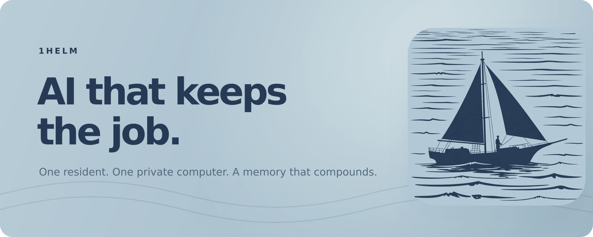

<p align="center">
  
</p>

<p align="center">
  <strong>Give every job a resident AI, a private computer, durable memory, and a chief of staff.</strong><br>
  1Helm turns capable models into a team that finishes the work—and gets better every time.
</p>

<p align="center">
  <a href="https://1helm.com/download/macos"><strong>Download for Apple Silicon</strong></a>
  &nbsp;·&nbsp;
  <a href="https://1helm.com/product">Product</a>
  &nbsp;·&nbsp;
  <a href="https://1helm.com/docs">Documentation</a>
  &nbsp;·&nbsp;
  <a href="docs/USER_GUIDE.md">User guide</a>
  &nbsp;·&nbsp;
  <a href="docs/VISION.md">Vision</a>
  &nbsp;·&nbsp;
  <a href="SECURITY.md">Security</a>
</p>

Agent turns follow a documented [durability and reliability contract](docs/RELIABILITY.md):
per-thread concurrency, generation-fenced single-writer responses, restart-safe
queues, durable connector delivery, narrow human blockers, and adversarial
release acceptance tests.

<p align="center">
  <code>Apple Silicon native</code>&nbsp;&nbsp;
  <code>34 complete playbooks</code>&nbsp;&nbsp;
  <code>Focused SkillsMD catalog</code>&nbsp;&nbsp;
  <code>Signed + notarized</code>
</p>

---

<p align="center">
  
</p>

## The job is the durable unit

Create a channel for product, finance, research, home, support, or anything
else that deserves an owner. 1Helm provisions a complete world around it:

| Every ordinary channel receives | What that changes |
|---|---|
| **One permanent resident** | Threads are sessions; the employee identity survives them. |
| **One private Linux computer** | Chat tools and Terminal use the same persistent `/workspace`. |
| **Memory with provenance** | Decisions, corrections, preferences, files, and outcomes become continuity. |
| **A serious skill arsenal** | Relevant playbooks activate automatically; routine tool use is not an approval ritual. |
| **Durable obligations** | Follow-ups, timers, workflows, and services can wake the computer back up. |
| **Skipper at the boundary** | Host work, credentials, fleet operations, and cross-channel work route themselves. |

The human sets the outcome and brings judgment, taste, credentials, and real
authority. The resident inspects, installs, edits, runs, retries, waits, and
verifies inside its own world. When it needs something outside that world, it
calls Skipper directly. Skipper acts and returns the exact thread to the same
resident automatically.

**The Captain is the leader—not the package manager, retry loop, permission
dialogue, or message bus between agents.**

## A company, not a collection of chat sessions

```text
Captain                      1Helm
   │
   │  “Own the launch and ship the fix.”
   ▼
Resident ─── routine execution ───► private channel computer
   │                                      │
   │ needs host, credential,              │ files · tools · services
   │ or another resident                  │ memory · obligations
   ▼                                      │
Skipper ─── crosses the boundary ─────────┘
   │
   └──────── automatic return ─────► Resident verifies and finishes
```

- **Captain** is the first user, workspace owner, and final human authority.
- **Skipper** is the one workspace-wide chief of staff and host/fleet operator.
- **Residents** are permanent specialists, one per ordinary channel.
- **Threads** are durable sessions—not the agent's entire identity.
- **The computer, memory, skills, and obligations** belong to the channel and
  survive model changes and application restarts.

## Ready on day one. Specialized by day one hundred.

<p align="center">
  
</p>

Every resident permanently owns the safe shipped library. The 34 complete
playbooks cover outcome ownership, Skipper handoff, obligations, skill
discovery, memory, research, email, calendar, contacts, messaging, documents,
spreadsheets, PDFs, meetings, projects, personal operations, travel, finance,
support, software delivery, data, media, infrastructure, security, and more.

1Helm selects only what the task needs. It can also:

- search the focused SkillsMD catalog of ready GitHub-backed repositories;
- install ready skills only after immutable revision pinning, bounds,
  scanning, hashing, provenance storage, and runtime-authority wrapping;
- route sources without a ready repository-specific procedure through the
  visible Learn a new skill workflow;
- crystallize a successful real workflow into a complete reusable procedure,
  including activation cues, authority boundaries, recovery, retained state,
  verification, and concrete completion evidence.

No user has to approve the existence or routine use of every safe skill.

## Connections without credential sprawl

<p align="center">
  
</p>

Connections are host-owned brokers, not secrets copied into every resident's
shell. Gmail exposes scoped account listing, search, read, and draft creation;
sending remains disabled by default. Photon maps allowlisted inbound iMessage
threads to a resident and permits narrow replies in an already-authorized
conversation. Provider, Gmail, and Photon credentials stay on the host.

New connection types have to earn their place with least-privilege scoping,
secret isolation, reconnect and recovery, deduplication, deterministic tests,
and an audit trail. A prompt saying “use this service” is not a connector.

## One model fabric

Connect multiple ChatGPT, Claude, Gemini/Antigravity, and xAI OAuth accounts;
OpenRouter, NVIDIA NIM, Cloudflare, GLM, and custom API keys; then enable exact
models and assemble fallback or round-robin routes.

Each signed-in workspace member connects their own OAuth accounts and API keys.
New accounts and routes are private to that member unless their owner explicitly
shares them with the workspace; shared accounts are usable but remain editable
only by their owner. Each member may inherit the workspace model or choose a
personal model from their own-plus-shared pool.

Changing a route never replaces the resident or discards its computer, memory,
skills, files, obligations, or thread history. The same fabric also exposes an
authenticated OpenAI- and Anthropic-compatible `/v1` endpoint for external
tools. Every member receives separate revocable keys whose identity selects that
same personal pool, plus a dedicated loopback port on the 1Helm host. The port
does not run on the laptop or phone viewing the web UI.

## What ships now

- Captain → Providers → Workspace onboarding in the signed Mac app.
- Exactly one resident for every ordinary channel and one Skipper in `#main`.
- A persistent Apple `container machine` Linux VM per ordinary channel, with
  `home-mount=none`, on supported Apple Silicon Macs.
- Shared channel `/workspace` for the agent command surface and human Terminal.
- Durable files, threads, curated memory, Mnemosyne long-term recall,
  corrections, follow-ups, and recurring workflows.
- Direct resident → Skipper escalation and automatic Skipper → resident return.
- A bounded outcome gate that keeps operational work moving when a model tries
  to stop at a tutorial, unevidenced blocker, unresolved tool failure, or
  “Skipper could help.”
- Outcome-first Activity with expandable work evidence and a tamper-evident
  SHA-256 chain for new operational events.
- Local-first collaboration through an optional workspace domain routed to the
  Captain's Mac; workspace state and provider credentials remain on that Mac.
- Host-owned updates: a signed native Mac updater plus an atomic, digest-verified Linux system service with health-check rollback.
- Automatic terminal heartbeat and silent same-session reconnection after
  backgrounding, focus changes, or brief network interruptions.
- Signed, Apple-notarized, stapled Apple Silicon DMG releases.

### Platform truth

| Platform | Current contract |
|---|---|
| **Apple Silicon macOS 26** | Native desktop product and real isolated Linux computer per resident. |
| **Linux / CI** | Durable headless compatibility backend; not per-resident VM isolation. |
| **Windows + WSL** | Headless compatibility path; not a native Windows app. |

Not yet shipped: native Windows and Linux desktop packages, mobile clients,
Linux resident VM isolation, a hosted control plane, rich Photon attachment
fidelity, or blind execution of community skills.

## Install on Apple Silicon

1. [Download the current signed DMG](https://1helm.com/download/macos).
2. Open it and drag **1Helm** to Applications.
3. Launch 1Helm. Gatekeeper verifies its Developer ID signature and Apple
   notarization ticket.
4. Complete Captain → Providers → Workspace. If required, approve Apple's
   signed container runtime once during workspace creation.

Application state lives under:

```text
~/Library/Application Support/1Helm
```

After the first install, Profile → Check for updates asks the Mac running
1Helm—not the device displaying the web UI—to download and verify the signed
update. **Restart & install** replaces the app while preserving that directory,
including credentials, databases, resident state, files, and workspaces.

The standard Linux installer similarly provisions a root-owned systemd updater.
The unprivileged web service may write only a fixed request file; systemd then
downloads the exact release artifact on the Linux host, verifies GitHub's
SHA-256 asset digest, stages a versioned release, switches atomically, restarts,
health-checks, and restores the previous release on failure. Arbitrary source
checkouts remain operator-managed and never send a Mac installer to the browser.

## Run the source workspace

The native Mac app is the complete consumer product. For development and
headless compatibility deployments, use Node 22:

```bash
PUPPETEER_SKIP_DOWNLOAD=1 npm install
npm run build
npm start                 # http://127.0.0.1:8123
```

A fresh data directory opens first-run setup. The source runtime defaults to
`./data`; do not point development at an existing production data directory.

### Core configuration

| Environment variable | Default | Meaning |
|---|---|---|
| `PORT` | `8123` | HTTP/WebSocket control-plane port. |
| `CTRL_DATA_DIR` | `./data` | Databases, routing state, uploads, and narrow workspace mirrors. |
| `HELM_CHANNEL_COMPUTER_BACKEND` | `apple` on macOS, `native` elsewhere | Explicit development/test backend override. |
| `HELM_CHANNEL_MACHINE_IMAGE` | `local/1helm-channel-machine:0.0.4` | Versioned Apple channel-machine image. |

### Agent-first JSON CLI

```bash
export HELM_URL=http://127.0.0.1:8123
export HELM_TOKEN='a 1Helm session token'

npm run helm -- channels
printf '%s\n' '{"channel_id":2,"body":"Own this outcome and verify it."}' \
  | npm run helm -- message
printf '%s\n' '{"channel_id":2,"name":"Weekly evidence","prompt":"Audit the launch and publish a verified status.","interval_seconds":604800}' \
  | npm run helm -- workflow-create
npm run helm -- audit-verify
```

## Architecture

1Helm is a compact Node/TypeScript control plane hosted by Electron on macOS.
It does not need an external database or a server transpilation step.

| Layer | Implementation |
|---|---|
| Runtime | Official Node 22 with native TypeScript stripping. |
| Control plane | `node:http`, WebSocket, additive SQLite migrations. |
| Client | Vanilla TypeScript bundled with esbuild and Tailwind CSS. |
| Model routing | Embedded ReRouted headless engine, private internal gateway, account pools, retries, routes, quotas, and logs. |
| Computers | Defensive argv-only Apple `container machine` backend; explicit compatibility backend elsewhere. |
| Terminal | `node-pty`; ordinary terminals enter their channel VM while Skipper remains native. |
| Memory | Curated records with provenance plus an isolated Mnemosyne SQLite store per identity. |
| Scheduling | Durable obligations, wake reconciliation, lifecycle safety, repair, update, and pressure-aware sizing. |
| Desktop | Sandboxed Electron renderer, ephemeral loopback server, persistent Application Support, native wake agent. |

Start with [`docs/VISION.md`](docs/VISION.md) for the product record and
[`docs/architecture`](https://1helm.com/docs/architecture) for the readable
system tour. [`SPEC.md`](SPEC.md) is the detailed behavioral contract.

## Verification

```bash
npm run typecheck
npm run build
npm test
npm run test:onboarding-browser
npm run benchmark:autonomy
```

The autonomy benchmark emits deterministic machine-readable JSON covering the
shipped playbook arsenal, narrow human-blocker gate, bounded outcome gate,
resident autonomy tools, wakeable recurring work, and audit-chain invariants
for its fixture. It is deliberately not presented as a live-model success rate
or a complete security score.

## Security boundary

- Resident Macs use separate Linux VMs with no native Mac home mount.
- Skipper's host tools require Captain-authorized provenance.
- Workspace file mirrors are channel-scoped, size-bounded, and symlink-contained.
- Provider and connection credentials stay in host-owned storage.
- Registration, sessions, JSON bodies, uploads, collaboration access, and
  gateway keys are bounded and independently controlled.
- New operational events enter an append-only hash chain. This is
  tamper-evident retained history, not a remotely witnessed transparency log.

See [`SECURITY.md`](SECURITY.md) and the
[security model](https://1helm.com/security) for the full boundary and current
dependency debt.

## Project record

- Product direction: [`docs/VISION.md`](docs/VISION.md)
- Changelog: [`CHANGELOG.md`](CHANGELOG.md)
- Release lifecycle: [`docs/release-lifecycle.md`](docs/release-lifecycle.md)
- Release checklist: [`docs/release-checklist.md`](docs/release-checklist.md)
- Governance: [`docs/GOVERNANCE.md`](docs/GOVERNANCE.md)
- Complete user guide: [`docs/USER_GUIDE.md`](docs/USER_GUIDE.md)

Every pull request and push to `main` runs typecheck, a production build, and
the complete `npm test` contract.

---

<p align="center">
  <br>
  <strong>Let them cook. Keep the helm.</strong><br>
  <sub>1Helm · MIT License</sub>
</p>
