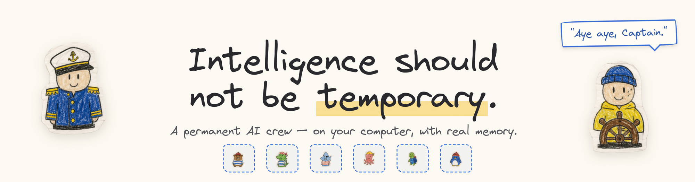
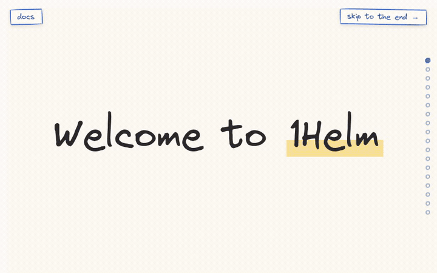
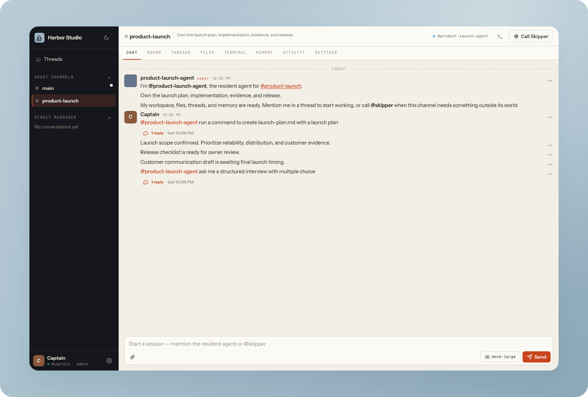
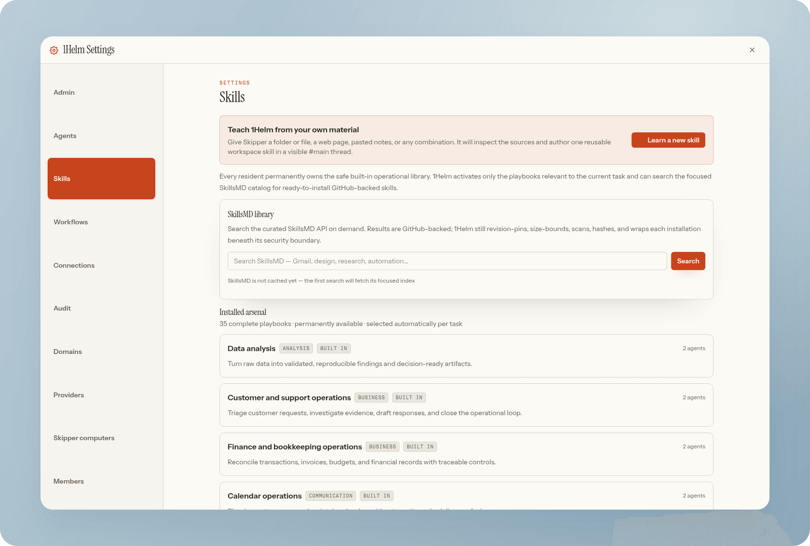
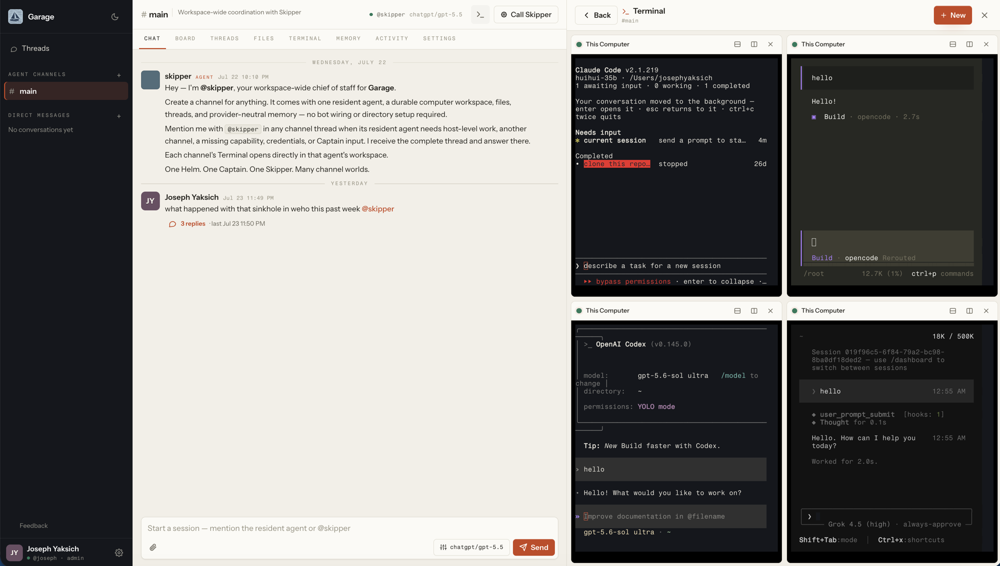
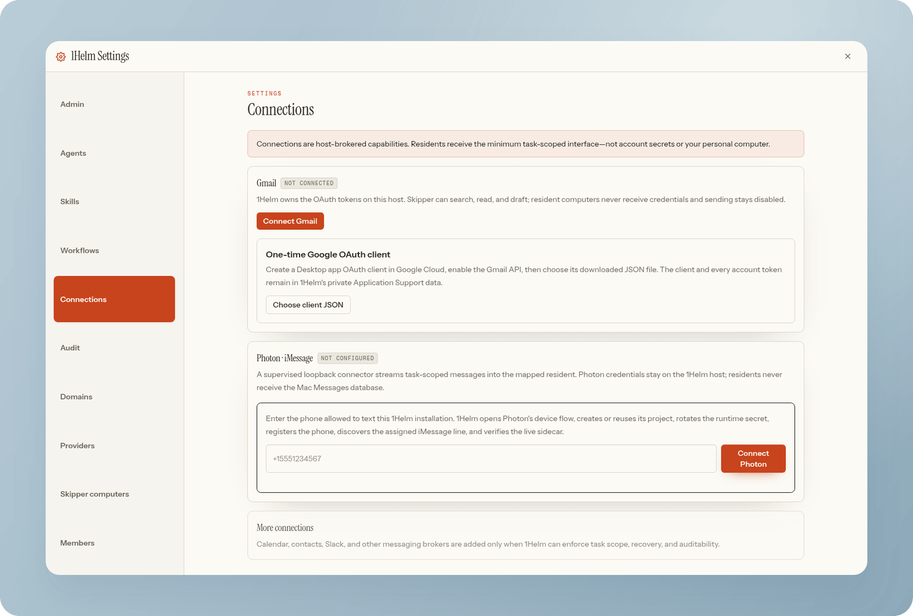

<p align="center">
  <picture>
    <source media="(prefers-color-scheme: dark)" srcset="docs/assets/readme-hero-dark.png">
    
  </picture>
</p>

<p align="center">
  <strong>Intelligence should not be temporary.</strong><br>
  1Helm gives every job a permanent AI resident with its own private computer, durable memory,
  and real skills — so the agent you train today is better at the job tomorrow.
</p>

<p align="center">
  <a href="https://1helm.com/download/macos"><strong>Download for Mac</strong></a>
  &nbsp;·&nbsp;
  <a href="https://1helm.com/download/windows"><strong>for Windows</strong></a>
  &nbsp;·&nbsp;
  <a href="https://1helm.com/manual/install-linux"><strong>for Linux</strong></a>
  &nbsp;·&nbsp;
  <a href="https://github.com/gitcommit90/1Helm/releases/latest"><strong>for Android</strong></a>
  &nbsp;·&nbsp;
  <a href="https://1helm.com">The story</a>
  &nbsp;·&nbsp;
  <a href="https://1helm.com/manual">Ship's manual</a>
  &nbsp;·&nbsp;
  <a href="docs/VISION.md">Vision</a>
  &nbsp;·&nbsp;
  <a href="SECURITY.md">Security</a>
</p>

<p align="center">
  <code>AGPL-3.0-only</code>&nbsp;&nbsp;
  <code>Self-hosted</code>&nbsp;&nbsp;
  <code>Model-agnostic</code>&nbsp;&nbsp;
  <code>Signed + notarized</code>&nbsp;&nbsp;
  <code>macOS · Windows · Linux · iOS · Android</code>
</p>

---

## The problem

Every AI chat you've ever had ends the same way: the context window fills, the
session dies, and everything the model learned fits on a sticky note addressed
to its replacement. One tab, one session, one race against the token timer.

That isn't a law of nature. It's a product decision — and 1Helm makes the
opposite one. Instead of renting intelligence by the session, you give each
ongoing job a **resident**: an agent with a stable identity, a persistent
private Linux computer, curated memory, and scheduled obligations that survive
restarts, model swaps, and closed laptops.

<p align="center">
  <a href="https://1helm.com">
    
  </a>
  <br>
  <sub>The whole story, as told at <a href="https://1helm.com">1helm.com</a> — click to scroll it yourself.</sub>
</p>

## The job is the durable unit

Create a channel for product, finance, research, home, support, or anything
else that deserves an owner. 1Helm provisions a complete world around it:

| Every ordinary channel receives | What that changes |
|---|---|
| **One permanent resident** | Threads are sessions; the employee identity survives them. |
| **One private Linux computer** | Chat tools and Terminal use the same persistent `/workspace`. |
| **Memory with provenance** | Decisions, corrections, preferences, files, and outcomes become continuity. |
| **A serious skill arsenal** | The agent sees what exists and loads a full procedure only when it chooses one. |
| **Durable obligations** | Follow-ups, timers, workflows, and services can wake the computer back up. |
| **Skipper at the boundary** | Host work, credentials, fleet operations, and cross-channel work route themselves. |

The human sets the outcome and brings judgment, taste, credentials, and real
authority. The resident inspects, installs, edits, runs, retries, waits, and
verifies inside its own world. When it needs something outside that world, it
calls Skipper directly. Skipper acts and returns the exact thread to the same
resident automatically.

**The Captain is the leader—not the package manager, retry loop, permission
dialogue, or message bus between agents.**

<p align="center">
  
</p>

## A company, not a collection of chat sessions

```text
Captain                      1Helm
   │
   │  “Own the launch and ship the fix.”
   ▼
Resident ─── routine execution ───► private channel computer
   │                                      │
   │ needs host, credential,              │ files · tools · services
   │ or another resident                  │ memory · obligations
   ▼                                      │
Skipper ─── crosses the boundary ─────────┘
   │
   └──────── automatic return ─────► Resident verifies and finishes
```

- **Captain** is the first user, workspace owner, and final human authority.
- **Skipper** is the one workspace-wide chief of staff and host/fleet operator.
- **Residents** are permanent specialists, one per ordinary channel.
- **Threads** are durable sessions—not the agent's entire identity.
- **The computer, memory, skills, and obligations** belong to the channel and
  survive model changes and application restarts.

## Install

On Apple Silicon:

1. [Download the current signed DMG](https://1helm.com/download/macos).
2. Open it and drag **1Helm** to Applications.
3. Launch 1Helm. Gatekeeper verifies its Developer ID signature and Apple
   notarization ticket.
4. Complete Captain → Providers → Workspace. If required, approve Apple's
   signed container runtime once during workspace creation.

This OCI generation starts in `~/Library/Application Support/1Helm-OCI-v1`;
the retired data directory is left untouched and is never imported. Every
update preserves it — credentials, databases, resident state, files, and
workspaces. Profile → Check for updates asks the Mac running 1Helm—not the
device displaying the web UI—to download and verify the signed update.

Windows 11 x64 gets a [Setup executable](https://1helm.com/download/windows)
that provisions one installation-scoped WSL 2 runtime and one durable OCI
container per ordinary channel. Linux hosts run the same channel containers
natively under Podman. The verified installer provisions a durable systemd
service with an atomic,
digest-verified, health-checked updater — see the
[Linux install guide](https://1helm.com/manual/install-linux). Whichever platform,
it works best on a dedicated machine: your crew works around the clock, and
your everyday computer takes naps.

Mac, Linux, and Windows use one synchronized desktop release version. A release
is held in full until the DMG/updater ZIP, Linux host archive, and signed
Windows Setup/Squirrel feed have all passed native install and update
acceptance from the same source commit.

### Connect from iPhone, iPad, or Android

The mobile apps are thin, native gateways to a 1Helm you already run. Install
and finish setup on a supported Mac, Windows, or Linux host first, give that
host an HTTPS address, then select that address in the app. The app loads the
selected instance's live frontend directly, so browsers, iPhone, iPad, and
Android always use the same current interface. Sign-in happens on that live
frontend; the password is never retained and the resulting session is stored
in the iOS Keychain or encrypted with a key held by Android Keystore.

- iPhone and iPad use the App Store build under the stable bundle identifier
  `com.gitcommit90.onehelm.mobile`.
- Android is distributed directly as `1Helm-<version>-universal.apk` on the
  matching GitHub Release. Android may ask you to allow installs from the app
  you used to open the file. Verify the release SHA-256 and install it; future
  releases signed by the same permanent 1Helm certificate install in place.
- The native clients require HTTPS, do not contain or initialize the 1Helm
  server or a frozen copy of its product frontend, and do not retain host data
  or provider credentials beyond the selected server address and secure
  session token. Native bridge access is restricted to that exact scheme,
  host, and port. Use **Disconnect** in the profile menu to erase both from the
  device.
- iPhone notifications are opt-in under **Settings → Notifications**. Device
  registration belongs to the signed-in account, per-channel mute still wins,
  and tapping an update opens its channel or thread. iOS camera and photo
  access is requested only after an explicit attachment action.

## Ready on day one. Specialized by day one hundred.

<p align="center">
  
</p>

Every resident starts with a seven-skill operational core plus the focused
playbooks selected by its channel template. The shared workspace catalog still
contains 34 complete procedures covering outcome ownership, Skipper handoff,
obligations, skill discovery, memory, research, email, calendar, contacts,
messaging, documents, spreadsheets, PDFs, meetings, projects, personal
operations, travel, finance, support, software delivery, data, media,
infrastructure, security, and more.

The model receives a compact inventory of its assigned skills—not all 34
procedures in every prompt. It loads one complete skill when useful and can ask
Skipper for another catalog skill when the job expands. A resident can also:

- search the open SkillsMD registry directly, then inspect and install a
  selected GitHub-backed skill — only after immutable revision pinning,
  bounds, scanning, hashing, provenance storage, and runtime-authority
  wrapping;
- learn a workspace-specific procedure from your local sources, URLs, and
  notes through the visible **Learn a new skill** workflow;
- crystallize a successful real workflow into a complete reusable procedure —
  activation cues, authority boundaries, recovery, retained state,
  verification, and concrete completion evidence.

That last one is the point: work through your invoices together once, and the
resident doesn't just remember the fact — it writes itself the procedure.
**Train it once. It's trained.**

## One model fabric

<p align="center">
  
  <br>
  <sub>Built-in split-pane terminals: one workspace, four panes, four different AI CLIs running side by side.</sub>
</p>

Connect multiple ChatGPT, Claude, Gemini/Antigravity, and xAI OAuth accounts;
OpenRouter, NVIDIA NIM, Cloudflare, GLM, and custom API keys; then enable exact
models and assemble fallback or round-robin routes. Model choice cascades —
Global → Channel → Session → Message — so you can swap engines mid-thread.

Changing a route never replaces the resident or discards its computer, memory,
skills, files, obligations, or thread history. **You're changing the engine,
not replacing the employee.**

Each signed-in workspace member connects their own OAuth accounts and API keys.
New accounts and routes are private to that member unless their owner explicitly
shares them with the workspace; shared accounts are usable but remain editable
only by their owner. The same fabric also exposes an authenticated OpenAI- and
Anthropic-compatible `/v1` endpoint for external tools, with separate revocable
keys per member.

## Connections without credential sprawl

<p align="center">
  
</p>

Connections are host-owned brokers, not secrets copied into every resident's
shell. Gmail exposes scoped account listing, search, read, and draft creation;
sending remains disabled by default. Photon gives the Captain one direct line
to Skipper: every text stays in a private Texts thread until `/new`, and that
same context can continue on desktop without echoing desktop-only turns back to
iMessage. Provider, Gmail, and Photon credentials stay on the host.

New connection types have to earn their place with least-privilege scoping,
secret isolation, reconnect and recovery, deduplication, deterministic tests,
and an audit trail. A prompt saying “use this service” is not a connector.

## What ships now

- Captain → Providers → Workspace onboarding in the signed Mac app.
- Exactly one resident for every ordinary channel and one Skipper in `#main`.
- A persistent, fully isolated Linux computer per ordinary channel on every
  supported platform (exact contracts in the table below).
- Shared channel `/workspace` for the agent command surface and human Terminal,
  with automatic terminal heartbeat and silent same-session reconnection.
- A traditional two-pane Files browser over that same `/workspace`, with
  breadcrumbs, nested folders, search, sorting, distinct file-type icons, and
  familiar create, rename, move, duplicate, delete, upload, and download actions.
- Cowork as the direct visual editing plane for `/workspace/notes`,
  `/workspace/whiteboards`, `/workspace/code`, `/workspace/docs`, and
  `/workspace/presentations`, with one consistent file rail, live collaborative
  text editors, embedded whiteboard and slide canvases, and an optional
  channel-agent panel that starts an ordinary thread with the open file path.
- Presentations define a visible, locked printable area (1500 × 1000 by
  default), allow custom page dimensions, and export the complete bounded slide
  deck as one multi-page PDF while excluding work outside each page.
- Quick Note in the top bar for capturing a Markdown note into
  `/workspace/notes` without leaving or repositioning the current channel view.
- Durable files, threads, curated memory, Mnemosyne long-term recall,
  corrections, follow-ups, and recurring workflows.
- Direct resident → Skipper escalation and automatic Skipper → resident return.
- Outcome-first Activity with expandable work evidence and a tamper-evident
  SHA-256 chain for new operational events.
- Local-first collaboration through an optional workspace domain routed to the
  Captain's Mac; workspace state and provider credentials remain on that Mac.
- Host-owned updates: a signed native Mac updater plus an atomic,
  digest-verified Linux system service with health-check rollback.
- Signed, Apple-notarized, stapled Apple Silicon DMG releases.
- Native iPhone/iPad and directly distributed Android gateway clients for an
  already configured HTTPS 1Helm host.

### Platform truth

| Platform | Current contract |
|---|---|
| **Apple Silicon macOS 26** | Native desktop product and real isolated Linux computer per resident (Apple `container machine`, `home-mount=none`). |
| **Linux / CI** | Supported headless systemd host with one durable Podman OCI container per resident, runtime-owned storage, and exact ownership checks; CI may select an explicit test backend. |
| **Windows 11 x64** | Native desktop product with one installation-scoped WSL 2 OCI runtime and one durable container per resident; Windows-drive mounts and interop are disabled. |
| **iPhone and iPad** | App Store gateway to an already configured HTTPS 1Helm host; sessions live in the device-only iOS Keychain. |
| **Android 7+** | Directly distributed signed universal APK gateway; sessions are encrypted by a key held in Android Keystore. |

Not yet shipped: a native Linux desktop shell, a hosted control plane, rich
Photon attachment fidelity, or blind execution of community skills.

## Run the source workspace

For development or a source deployment outside the verified platform
installers, use Node 22:

```bash
PUPPETEER_SKIP_DOWNLOAD=1 npm install
npm run build
npm start                 # http://127.0.0.1:8123
```

A fresh data directory opens first-run setup. The source runtime defaults to
`./data`; do not point development at an existing production data directory.

### Core configuration

| Environment variable | Default | Meaning |
|---|---|---|
| `PORT` | `8123` | HTTP/WebSocket control-plane port. |
| `CTRL_DATA_DIR` | `./data` | Databases, routing state, uploads, and non-OCI development/Apple workspace mirrors. |
| `HELM_CHANNEL_COMPUTER_BACKEND` | `apple` on macOS, `oci` on Linux and Windows | Host isolation backend; `native` and `mock` are explicit development/test overrides. |
| `HELM_CHANNEL_MACHINE_IMAGE` | `local/1helm-channel-machine:0.0.29` | Versioned channel-machine image contract. |

### Agent-first JSON CLI

```bash
export HELM_URL=http://127.0.0.1:8123
export HELM_TOKEN='a 1Helm session token'

npm run helm -- channels
printf '%s\n' '{"channel_id":2,"body":"Own this outcome and verify it."}' \
  | npm run helm -- message
printf '%s\n' '{"channel_id":2,"name":"Weekly evidence","prompt":"Audit the launch and publish a verified status.","interval_seconds":604800}' \
  | npm run helm -- workflow-create
npm run helm -- audit-verify
```

## Architecture

1Helm is a compact Node/TypeScript control plane hosted by Electron on macOS
and in the accepted Windows implementation, or by systemd on Linux. It does not
need an external database or a server transpilation step.

| Layer | Implementation |
|---|---|
| Runtime | Official Node 22 with native TypeScript stripping. |
| Control plane | `node:http`, WebSocket, additive SQLite migrations. |
| Client | Vanilla TypeScript bundled with esbuild and Tailwind CSS. |
| Model routing | Embedded ReRouted headless engine, private internal gateway, account pools, retries, routes, quotas, and logs. |
| Computers | Defensive argv-only Apple `container machine`; native Podman OCI on Linux; one shared managed WSL 2/Podman runtime on Windows; explicit `native`/`mock` test seams. |
| Terminal | `node-pty`; ordinary terminals enter their channel VM while Skipper remains native. |
| Memory | Curated records with provenance plus an isolated Mnemosyne SQLite store per identity. |
| Scheduling | Durable obligations, wake reconciliation, lifecycle safety, repair, update, and pressure-aware sizing. |
| Desktop | Sandboxed Electron renderer, ephemeral loopback server, persistent host data, and native wake/update integration on supported desktop hosts. |

Start with [`docs/VISION.md`](docs/VISION.md) for the product record and
[`docs/architecture`](https://1helm.com/manual/architecture) for the readable
system tour. [`SPEC.md`](SPEC.md) is the detailed behavioral contract.

## Verification

Agent turns follow a documented
[durability and reliability contract](docs/RELIABILITY.md): per-thread
concurrency, generation-fenced single-writer responses, restart-safe queues,
durable connector delivery, narrow human blockers, and adversarial release
acceptance tests.

```bash
npm run typecheck
npm run build
npm test
npm run test:onboarding-browser
npm run benchmark:autonomy
```

The autonomy benchmark emits deterministic machine-readable JSON covering the
shipped skill arsenal, compact capability map, narrow human-blocker boundary,
resident autonomy tools, wakeable recurring work, and audit-chain invariants
for its fixture. It is deliberately not presented as a live-model success rate
or a complete security score.

Every pull request and push to `main` runs typecheck, a production build, and
the complete `npm test` contract.

## Security boundary

- Residents use separate Linux worlds: Apple machines with no Mac home mount,
  or durable OCI containers on Linux and inside Windows' one shared managed
  WSL runtime. Windows-drive mounts and interop are disabled.
- Skipper's host tools require Captain-authorized provenance.
- OCI workspace storage is runtime-owned and authoritative; Files and Cowork
  access it directly through a channel-scoped boundary. Apple mirrors remain
  size-bounded and symlink-contained.
- Provider and connection credentials stay in host-owned storage.
- Registration, sessions, JSON bodies, uploads, collaboration access, and
  gateway keys are bounded and independently controlled.
- New operational events enter an append-only hash chain. This is
  tamper-evident retained history, not a remotely witnessed transparency log.

See [`SECURITY.md`](SECURITY.md) and the
[security model](https://1helm.com/manual/security-model) for the full boundary and current
dependency debt.

## Project record

- Product direction: [`docs/VISION.md`](docs/VISION.md)
- Complete user guide: [`docs/USER_GUIDE.md`](docs/USER_GUIDE.md)
- Changelog: [`CHANGELOG.md`](CHANGELOG.md)
- Release lifecycle: [`docs/release-lifecycle.md`](docs/release-lifecycle.md)
- Release checklist: [`docs/release-checklist.md`](docs/release-checklist.md)
- Governance: [`docs/GOVERNANCE.md`](docs/GOVERNANCE.md)
- Terms & privacy: [1helm.com/terms](https://1helm.com/terms) · [1helm.com/privacy](https://1helm.com/privacy)
- Company contact: [`build@1helm.com`](mailto:build@1helm.com)

---

<p align="center">
  <br>
  <strong>Let them cook. Keep the helm.</strong><br>
  <sub>1Helm · AGPL-3.0-only · Copyright © 2026 Joseph Yaksich</sub>
</p>
