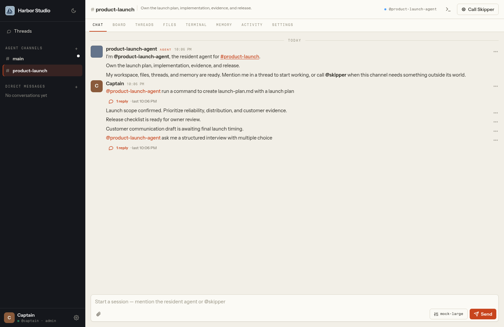
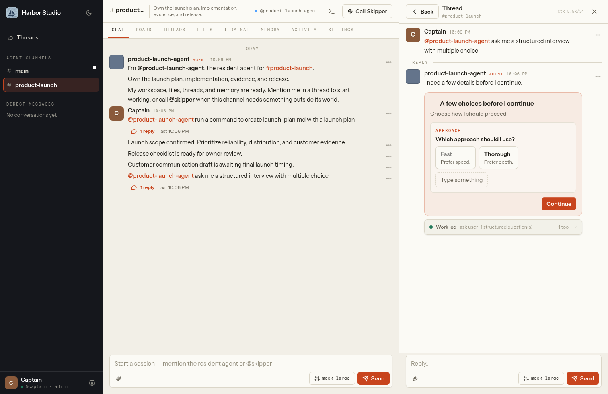
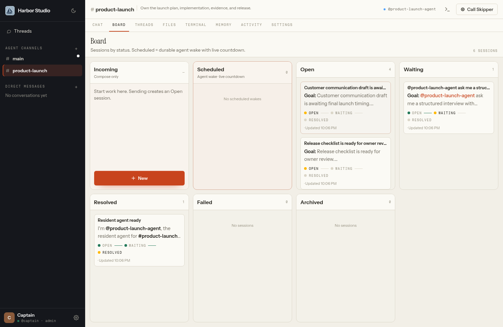
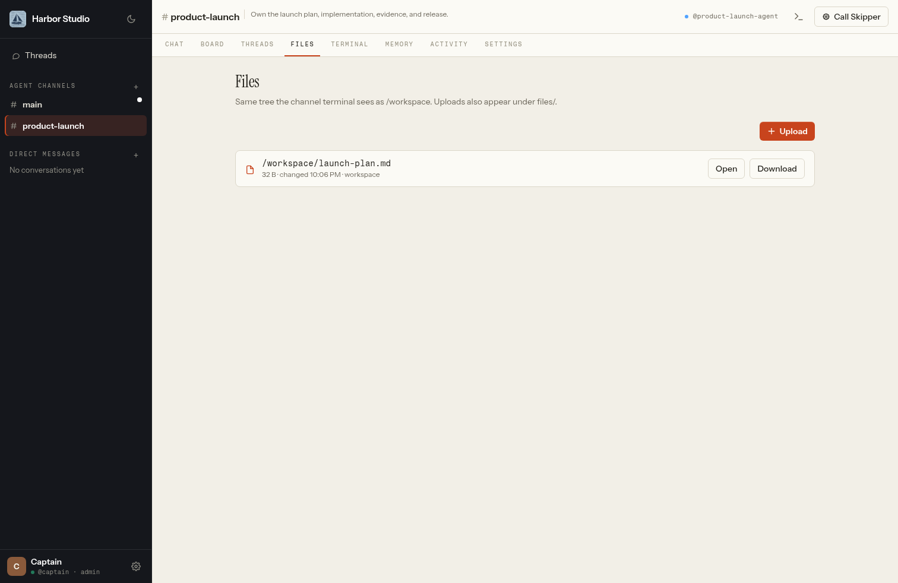
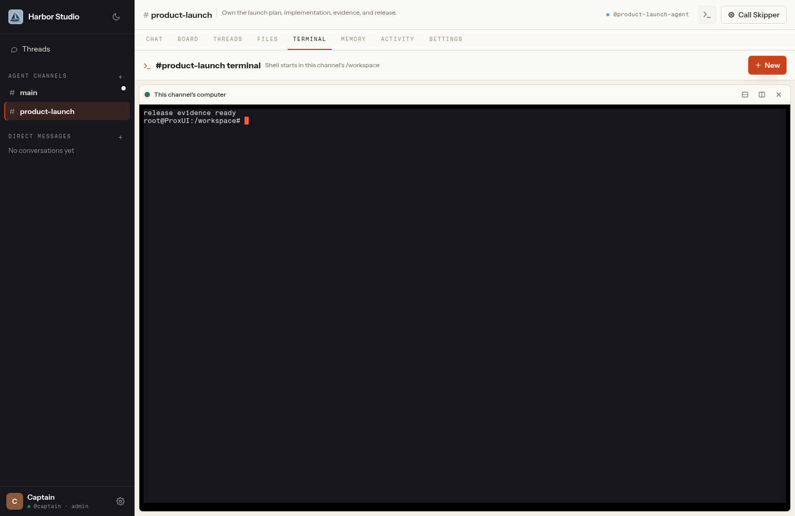
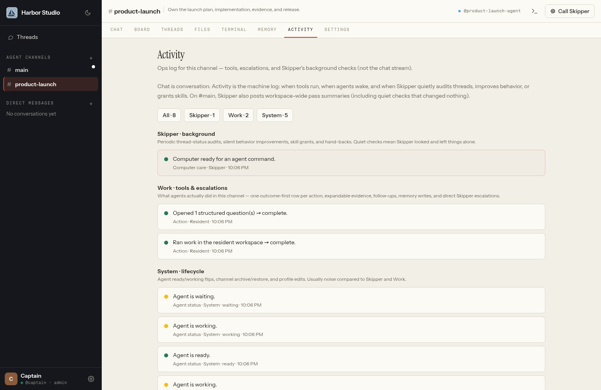
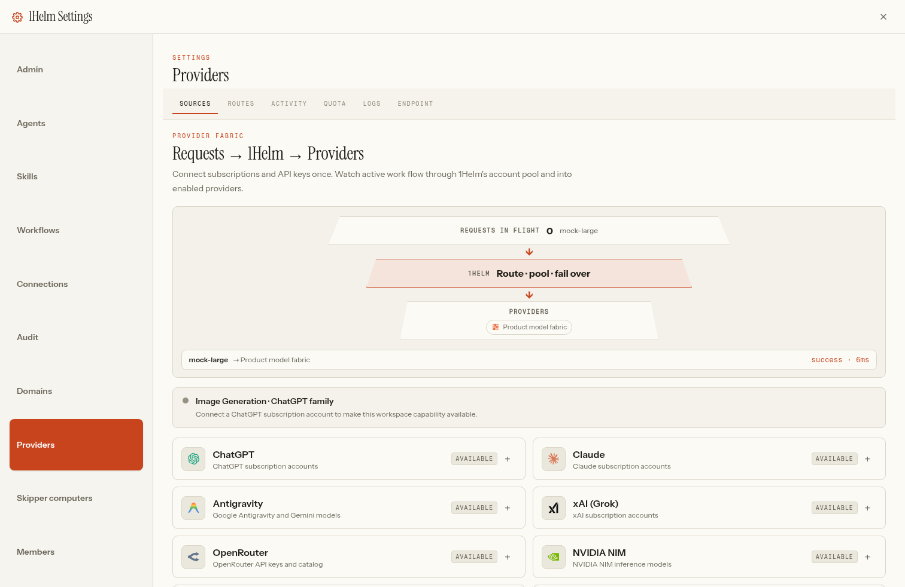
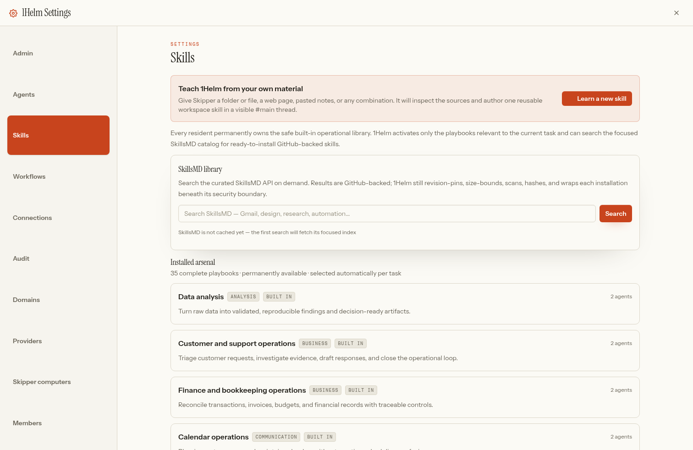
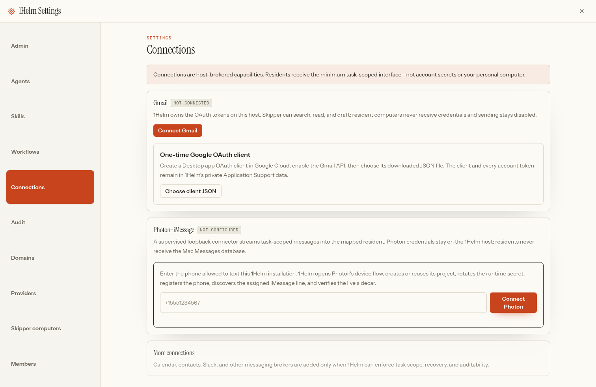
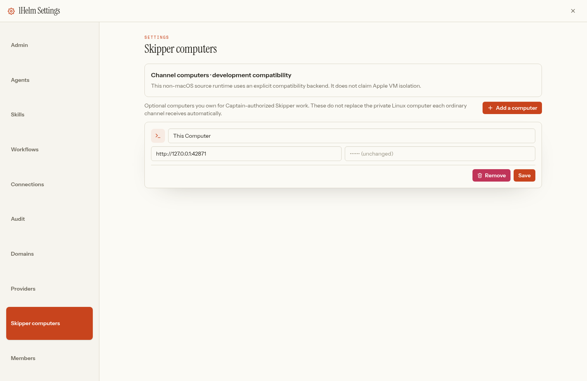

# 1Helm user guide

1Helm gives each ongoing job a resident AI, a persistent private Linux computer,
durable memory, files, sessions, skills, and obligations. Skipper is the one
workspace-wide chief of staff that can cross boundaries on the Captain's behalf.

This guide describes the shipped product. Its screenshots were captured from the
real application and deterministic local provider—not from mockups.

## The operating model

- **Captain** is the workspace owner and final human authority. The Captain sets
  outcomes, supplies judgment and credentials when genuinely required, and can
  manage the whole workspace.
- **Skipper** lives in the Captain's private `#main`. Skipper inventories and
  manages channels, residents, computers, obligations, audits, connectors, and
  host-authorized work. Ask in plain language; Skipper has native control-plane
  actions and should not inspect directories to guess 1Helm state.
- **Residents** are permanent specialists. Every ordinary channel creates
  exactly one resident and one isolated persistent Linux computer. Changing a
  model or starting a new thread never replaces that identity or its world.
- **Coworkers** receive a private Skipper `#main` and the human-only Collab
  space. A coworker-created channel remains private until its owner explicitly
  tags and confirms another member. The Captain does not silently inherit it.



## Channels and lifecycle

Create a channel for a durable area of responsibility: a product, launch,
inbox, household, client, research stream, or project. The channel owns its
resident, computer, `/workspace`, files, threads, memory, skills, and scheduled
obligations.

Use Skipper in `#main` for workspace inventory and lifecycle work:

```text
@skipper what channels exist
@skipper inspect #product-launch
@skipper sunset #ideas
@skipper sunset and delete #ideas
@skipper inspect the computer fleet and due obligations
```

Archive is the safe sunset: it preserves the resident world and disk while
pausing active workflows and cancelling unsafe wake obligations. Restore reuses
that exact world. Permanent deletion requires an already archived non-main
channel and removes only that named private world. `#main` cannot be archived or
deleted. The sidebar updates immediately when Skipper performs lifecycle work.

## Chat, streaming, attachments, and questions

Mention the resident to start a job. In a one-human/one-agent thread, subsequent
messages remain conversational without repeated mentions. Mention Skipper for a
boundary outside the resident computer; the resident can also call Skipper
itself, and the runtime returns the unblocked thread automatically.

Agent replies stream into one stable message. Draft text, focus, selection,
scroll position, and open work logs remain stable while updates arrive. Use the
Stop control to interrupt only the active turn; the next reply receives hidden
continuation context without changing your visible text.

Attach a file from the composer or upload it in Files. Every attachment has
explicit **Open** and **Download** actions. Safe image, text, PDF, audio, and
video formats preview inside 1Helm; unsupported types remain downloadable.

When a genuinely consequential human-only choice is required, the agent can
show structured options. Click a choice, confirm its highlighted state, and
choose **Continue**. Single-select answers are stored once, displayed in the
conversation, and immediately resume the same thread.



Agents may use structured questions only for evidenced human judgment, missing
credentials, external authority, or irreversible commitment. Routine setup,
installs, downloads, retries, and inspectable facts are not interview material.
Consecutive interview rounds are rejected unless intervening action or new
evidence exists.

## Threads and Board

A thread is a durable work session inside a resident's larger identity. It has
its own status, summary, model override where allowed, usage, replies, follow-up,
and optional guest expert. Resolving a thread revokes thread-only guests without
changing channel membership.

**Threads** lists sessions and supports focused review. **Board** organizes the
same durable sessions into status lanes. Crowded lanes scroll vertically, and
the workspace-wide Threads entry provides a cross-channel view.



## Files and Terminal

Files and Terminal are two views of the same channel computer. Agent commands
and the human Terminal both start in the channel's persistent `/workspace`.
Files created through either path appear in Files after reconciliation.



The terminal prompt displays the live current path and changes after `cd`.
1Helm sends a terminal heartbeat while the pane is open and automatically
reconnects a dropped browser transport to the same live shell. Briefly
backgrounding the app or changing networks does not print disconnect noise or
discard the shell's working directory, exported variables, running process, or
scrollback. If the host confirms that the underlying terminal session itself no
longer exists, 1Helm opens a fresh one.
Ordinary residents cannot select or enter the Captain's native Mac. On supported
Apple Silicon Macs, each resident runs inside its own Apple `container machine`
with `home-mount=none`; source/CI compatibility backends do not claim equivalent
VM isolation.



## Memory, Activity, and audit

**Memory** contains curated facts, decisions, corrections, preferences, and
procedures with provenance—not a transcript dump. Each resident and Skipper also
has an isolated Mnemosyne store for longer-term recall.

**Activity** presents outcome-first operational rows that mutate from working to
complete or failed. Expand a row for the retained input and outcome evidence.



New tool/activity events enter a SHA-256 hash chain. Settings → Audit verifies
continuity and identifies the first invalid sequence after exact-payload
tampering. This is local tamper evidence, not a remotely witnessed transparency
log.

## Settings

The gear opens a full-screen settings application. On desktop, use its vertical
sidebar; smaller layouts use a compact non-scrolling grid.

- **Admin** — workspace name, theme, image, and release/update information.
- **Agents** — Skipper and resident identities, status, models, capabilities,
  and channel ownership.
- **Skills** — built-in arsenal, focused SkillsMD catalog, installed skills,
  and Learn a new skill.
- **Workflows** — recurring resident work, next run, pause/resume, run counts,
  and failures.
- **Connections** — native host-brokered Gmail and Photon configuration.
- **Audit** — retained events and hash-chain verification.
- **Domains** — local-first collaboration and optional Cloudflare domain.
- **Providers** — accounts, keys, models, routes, quotas, logs, and endpoint.
- **Skipper computers** — optional Captain-owned computers for authorized
  Skipper work; these never replace resident Linux computers.
- **Members** — coworkers, access requests, and invitations.

## Providers, models, and routes

Accounts and keys form one fabric. Connect multiple ChatGPT, Claude,
Gemini/Antigravity, and xAI OAuth accounts plus keyed OpenRouter, NVIDIA NIM,
Cloudflare, GLM, or custom OpenAI-compatible endpoints. Enable accounts and
models independently, then use a direct model or named fallback/round-robin
route.

Providers are member-owned. Any signed-in member may connect their own OAuth
accounts or API keys. A new provider or route starts private: only its owner can
see and use it. The owner may explicitly choose **Share with workspace**, which
makes it available to teammates without letting them reconnect, disable,
reconfigure, or delete the owner's credential. A shared route can reference
only providers that are also shared. Each member can choose **My model** from
their own-plus-shared pool or return to the Captain's workspace default.



The visualization reflects live requests and their selected destination.
Disabled or exhausted accounts are excluded from eligible attempts; one disabled
account does not prevent a healthy account in the same family from serving its
shared model. Quotas and Logs provide account-aware evidence, and disabled
accounts must not appear in a request's attempts or log record.

The Endpoint section manages separate external gateway keys for the signed-in
member. A personal key sent to the workspace `/v1` URL is also the routing
identity: requests see only that member's providers plus accounts explicitly
shared with the workspace. Each member additionally receives a distinct
loopback port on the 1Helm host for host-local tools. That port is a convenience,
not an unauthenticated trust boundary; clients still use a personal revocable
key. 1Helm agents use a separate private internal credential that is not
exposed, disabled, or revoked with external keys.

## Current events and real images

Recent-event questions trigger public web or news research immediately. The
agent should search before asking for ordinary identifying details, inspect the
useful source, and answer once with publication dates and clickable source
links. When the user asks to see a real event, the agent attaches an image
returned by that research with its article source and caption. Generated art is
reserved for requests to create or illustrate something and cannot silently
stand in for a news photograph.

## Skills and Learn a new skill

Every resident permanently owns the built-in operational arsenal. The model
sees a compact inventory, can list the available skills, and loads the full
procedure for one skill only when it chooses to use it. The procedures are not
injected wholesale into every turn.



Settings searches the focused SkillsMD catalog of ready GitHub-backed
repositories. A catalog install resolves an immutable revision, selects bounded
skill documentation, scans it, stores a SHA-256 digest and provenance, and wraps
it beneath 1Helm runtime authority. Unsafe content is blocked. When a ready
repository-specific procedure is unavailable, choose **Learn a new skill** so
Skipper can inspect supplied local sources, web URLs, and notes in a visible
thread and author a workspace-specific procedure.

A question such as “do we have a calendar skill?” can be answered directly
from the agent's actual arsenal inventory without installing anything or
opening an interview.

## Gmail

Settings → Connections → Gmail owns the connection on the 1Helm host.

1. Once per Google Cloud project, create a Desktop app OAuth client, enable the
   Gmail API, and choose the downloaded JSON in 1Helm.
2. Choose **Connect Gmail**. 1Helm opens a state-protected PKCE authorization and
   receives the callback on loopback.
3. Return to 1Helm after Google confirms the account.



You can also say `@skipper can we set up Gmail`. Skipper calls the native
connector immediately; it does not ask a sequence of redundant access
questions. Skipper can use connected accounts directly in the Captain's
authorized thread. In an ordinary channel, Skipper can grant only named
accounts to that resident. Gmail supports account inventory, search, read, and
draft creation. Sending remains disabled. OAuth tokens live under 1Helm's
host-owned data and never enter chat, Activity evidence, or a resident computer.

The loopback callback belongs to the installed/local 1Helm host. A remotely
viewed demo cannot authorize Gmail on a different machine.

## Photon / iMessage

Connections guides Photon device authorization, project setup, secret rotation,
phone registration, sidecar health, and conversation mapping. The first mapping
defaults to the Captain's `#main` and Skipper.

An allowlisted inbound text creates a real 1Helm thread, invokes the mapped
agent, retains its reply in 1Helm, and sends that final reply to the exact inbound
conversation once. If the agent explicitly uses `photon_send`, the automatic
return suppresses its duplicate. New unrelated outbound destinations remain
blocked unless explicitly granted. Rich attachment fidelity is not yet part of
the verified contract.

## Workflows, follow-ups, and computer care

A follow-up is a one-shot durable wake on an existing thread. A workflow is a
recurring obligation with an interval, next run, status, run count, and optional
maximum. These obligations survive restarts and can wake a sleeping resident
computer.

Skipper reconciles computer state, obligations, CPU/RAM/disk pressure, sleep,
wake, resize, update, repair, archive, restore, and deletion safety. Users do
not manually size routine resident machines. Archive pauses active workflows;
it never silently discards scheduled state.



Settings → Skipper computers lists optional endpoints the Captain owns for
authorized host-level Skipper work, including This Computer and remote
Open-Terminal endpoints. Residents never receive these computers.

## Domains, collaboration, members, and privacy

The installed Mac can reserve a local-first `1helm.com` workspace address and
optionally connect a Cloudflare domain. The Mac remains the only workspace
server; sleeping or shutting it down makes the workspace unavailable.

Public registration closes after the Captain account. Access requests appear in
Settings → Members and create an LLM-independent notice in the Captain's
`#main`. Collab is human-only and has no resident, bot, terminal, computer,
model policy, or Files world. Channel membership gates HTTP, files, terminals,
messages, and WebSocket fan-out.

## Updates, removal, and recovery

Signed desktop releases are unique patch versions. Profile → Check for updates
always operates on the machine hosting the active 1Helm instance. In the native
Mac app, Electron downloads and verifies a notarized update ZIP on that Mac and
offers **Restart & install** only when it is ready. It does not navigate the
browsing device to a DMG.

The standard Linux systemd install uses a root-owned updater. 1Helm can request
that one fixed operation, but cannot choose an arbitrary URL, command, or target
path. The host updater requires a stable GitHub release and its SHA-256 asset
digest, installs into a versioned directory, switches the current symlink
atomically, restarts, health-checks, and restores the prior release if needed.
Source/developer deployments report that their host operator owns updates.

Every host update preserves:

```text
~/Library/Application Support/1Helm
```

On macOS that directory contains databases, credentials, workspaces, resident
state, and narrow mirrors. Linux preserves the equivalent host state under
`/var/lib/1helm`. Do not delete either data root during replacement.

Before removing 1Helm, use its removal preparation flow. It is Captain-only,
requires typed confirmation, reports backend-owned resident machines, and
prepares those machines for safe deletion. Export or back up irreplaceable
channel files first.

Recovery principles:

- restore an archived channel rather than recreating it;
- retry after provider/account health is restored—the resident identity stays;
- use Skipper fleet inspection for stopped or unhealthy computers;
- verify Settings → Audit after suspected retained-state tampering;
- preserve Application Support before reinstalling or moving the app;
- never work around a failed signature, notarization ticket, or Gatekeeper
  result with an ad-hoc build.

## Troubleshooting

**A button highlights but Continue does nothing.** Ensure every visible question
has one selected option or typed answer. If it still fails, capture the thread
and app version; selection and the submitted answer should survive live repaints.

**Skipper reports only `#main`.** Ask `@skipper what channels exist`. Inventory
comes from the native control plane and should include every channel in your
authorized scope, including archived channels when requested.

**Gmail asks for repeated choices.** Start with `@skipper can we set up Gmail` or
Connections → Gmail. The native connector path should run directly and must not
open consecutive interviews.

**A model keeps using a disabled account.** Confirm the account is disabled in
Providers, reproduce one request, then inspect Logs. Disabled accounts should
be absent—not merely fail first. Preserve the log and app version for support.

**Terminal and Files disagree.** Refresh Files after the command completes and
confirm the prompt is within `/workspace`. Agent commands, Terminal, and Files
share the channel computer; host paths are not a resident workspace.

**A scheduled job did not run.** Inspect Workflows/Board and ask Skipper to list
obligations and reconcile the fleet. An archived channel intentionally pauses
workflow execution.

**PDF preview is blank.** Retry Open, then Download. In-app PDFs use a narrowly
allowed same-origin/blob frame; the downloaded file remains the authoritative
fallback.

## Security summary

- Per-resident Apple Linux VMs have no Mac home mount.
- Credentials and connectors remain host-owned and minimally brokered.
- Membership scopes data and live events; private coworker channels are not
  Captain-readable without invitation.
- Files are size-bounded and symlink-contained.
- Agent interviews have a narrow human-only policy.
- External skills are revision-pinned, bounded, scanned, hashed, and wrapped.
- Operational history is locally tamper-evident.
- Signed releases are Developer ID signed, notarized, stapled, and Gatekeeper
  verified before publication.

For the detailed boundary, see [SECURITY.md](../SECURITY.md). For product intent,
see [VISION.md](VISION.md).
